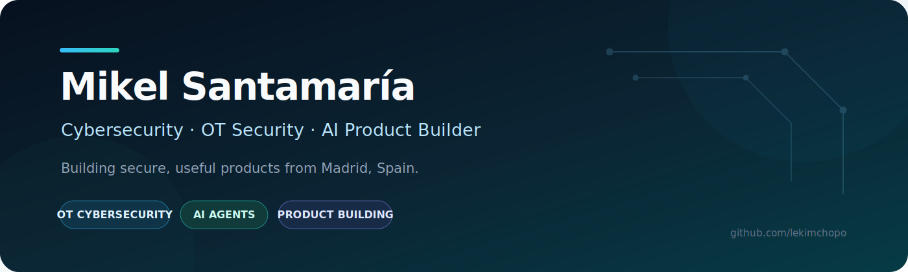

<picture>
  <source media="(prefers-color-scheme: dark)" srcset="./assets/profile-header-dark.svg">
  <source media="(prefers-color-scheme: light)" srcset="./assets/profile-header-light.svg">
  
</picture>

<div align="center">

[](https://github.com/lekimchopo)
[](https://github.com/lekimchopo)
[](https://github.com/lekimchopo?tab=repositories)
[](#featured-case-studies)

</div>

## About me

I am **Mikel Santamaría**, working in **OT cybersecurity sales** while studying **Cybersecurity Engineering**.

I build practical products at the intersection of **cybersecurity, applied AI, cloud platforms and user-focused software**. My approach combines technical curiosity with commercial thinking: understand the real problem, design a realistic solution, protect the data and ship something useful.

- 🛡️ Developing my expertise in **OT/ICS security**, infrastructure, identity and secure-by-design products.
- 🤖 Building applications and local agents with **Gemini, OpenAI, LM Studio and self-hosted tooling**.
- 🚀 Turning prototypes into deployable products with **React, TypeScript, Supabase, Vercel, Google Cloud and Shopify**.
- 📍 Based in **Madrid, Spain**.

---

## What I work on

<table>
<tr>
<td width="33%" valign="top">

### 🛡️ Cybersecurity & OT

Industrial cybersecurity, network visibility, identity, endpoint management and practical risk reduction.

`OT / ICS` · `Zero Trust` · `IAM` · `Networking` · `Security Operations`

</td>
<td width="33%" valign="top">

### 🤖 Applied AI

Assistants, document analysis, image understanding, recommendations and hybrid local/cloud agents.

`AI Agents` · `Gemini` · `OpenAI` · `Local LLMs` · `Structured Outputs`

</td>
<td width="33%" valign="top">

### 🚀 Product Building

From initial concept to UX, architecture, testing, deployment and business validation.

`Product Strategy` · `PWA` · `SaaS` · `E-commerce` · `Automation`

</td>
</tr>
</table>

---

## Featured case studies

These public case studies explain the problem, architecture, security decisions and lessons behind private product repositories without exposing credentials, user data or proprietary source code.

| Project | Product focus | Architecture highlights | Case study |
|---|---|---|---|
| **MiHucha** | Personal finance, budgeting and secure AI assistance | React, Supabase Auth, PostgreSQL, RLS, server-side Gemini proxy, recoverable snapshots | [Read case study](./docs/case-studies/mihucha.md) |
| **NutriSnap** | Camera-assisted nutrition tracking | React 19, structured AI output, Gemini multimodal, Supabase, Capacitor | [Read case study](./docs/case-studies/nutrisnap.md) |
| **SubControl** | Subscription management and savings simulation | React, deterministic finance logic, Recharts, Gemini, Vitest, offline PWA | [Read case study](./docs/case-studies/subcontrol.md) |
| **Block Nine** | Streetwear brand and production-ready e-commerce workflow | Shopify OS 2.0, Liquid, React prototype, controlled pre-production releases | [Read case study](./docs/case-studies/block-nine.md) |
| **Local Agent Lab** | Private and self-hosted AI workflows | LM Studio, OpenClaw, WSL2, Linux services, WhatsApp workflows, hybrid model routing | [Read case study](./docs/case-studies/local-agent-lab.md) |

> The underlying repositories remain private while they are being hardened, validated or prepared for release.

---

## Public work

### [AI & Automation Lab](https://github.com/lekimchopo/Codex)

A public repository for small, reviewable experiments around Python, security utilities, AI-assisted development and automation. It currently includes a cryptographically secure password generator and is being expanded into a better documented engineering lab.

---

## Technology stack

### Development


### Data, cloud and deployment


### AI, systems and security


---

## Education and credentials

- 🎓 **Cybersecurity Engineering** — currently studying.
- 🖥️ **Higher Technician in Network Systems Administration (ASIR)**.
- 🔧 **Technician in Microcomputer Systems and Networks (SMR)**.
- 📘 **ITIL 4 Foundation** certified.
- ☁️ **Google IT Support** training.

---

## Current focus

```text
01  Deepen my knowledge of OT/ICS cybersecurity
02  Build secure AI products with measurable real-world value
03  Improve local-first agents and private AI workflows
04  Publish stronger technical case studies and open-source projects
05  Grow into a hybrid technical-commercial cybersecurity profile
```

---

## Engineering principles

- **Security before convenience:** secrets, authentication and personal data must be handled intentionally.
- **Useful AI over AI theatre:** every model call should solve a concrete user problem.
- **Local-first when it makes sense:** privacy, resilience and cost matter.
- **Build, test, document, improve:** a product is more than a working demo.
- **Business context matters:** technical decisions should support a sustainable outcome.

---

<div align="center">

### Building secure, useful products — one iteration at a time.

[](https://github.com/lekimchopo?tab=repositories)

</div>
